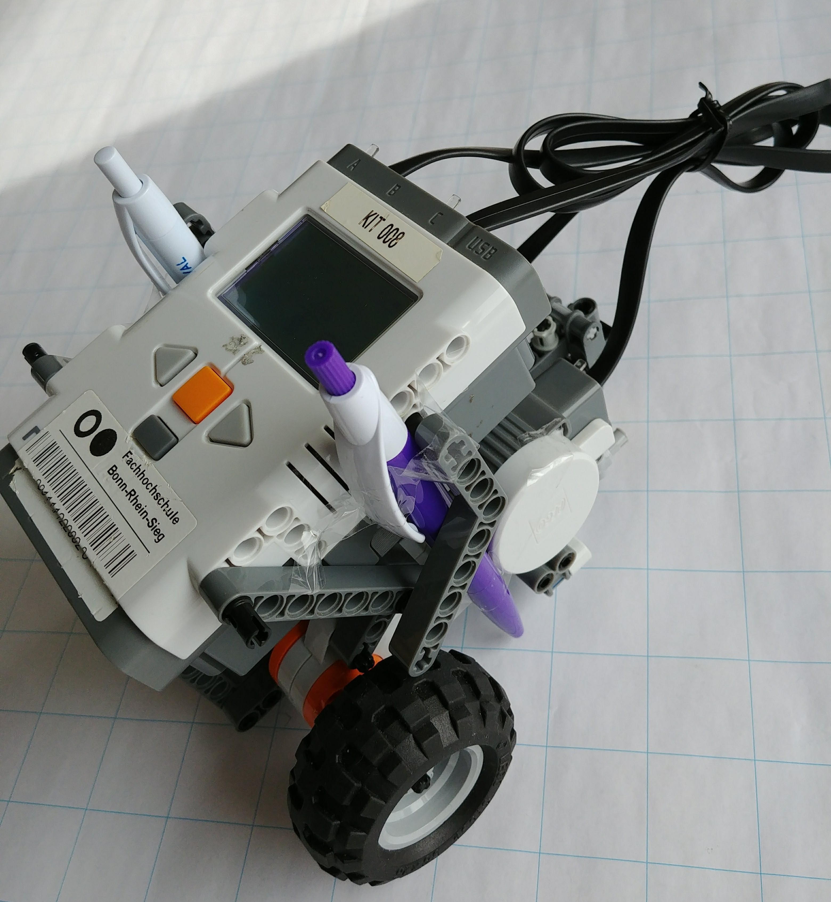
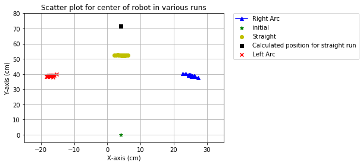

---
bibliography:
- 'references.bib'
...

Scientific Experimentation and
Evaluation

Assignment: 02

26-April-2018

Relevant Aspects of Experiment
==============================

Design of Robot
---------------

-   The robot has been designed with three wheels.

-   Two of these are driving wheels and are connected to the motors,
    thus enabling a differential drive systems; and the third is a
    driven wheel.

Measurement of Start and Stop Positions
---------------------------------------

-   Two pens will be fixed near the two driving wheels. The lines
    joining these two points will be in parallel to the driving axle
    (considering the axis between two driving wheels).

-   The axis formed between these two points will be used to mark the
    orientation of robot, with respect to the coordinate system defined
    (described below).

-   The starting position will be when this line lies on the x-axis of
    the coordinate system; the end position can be relatively measured.

Parameters used to drive the robot
----------------------------------

-   Constant angular and translational speed for a fixed time period to
    describe an arc to left.

-   Constant translational speed and no angular speed for a fixed time
    period to describe a straight line.

-   Constant angular and translational speed for a fixed time period to
    describe an arc to right.

Program used to drive the robot
-------------------------------

-   Using the Lego Mindstorms NXT 2.0 software, we created the scenarios
    for three run sequences.

-   Straight Line:

    -   Power: 50%

    -   Duration: 3 Seconds

    -   Steering Angle: 0 degrees

-   Left Arc:

    -   Power: 50%

    -   Duration: 3 Seconds

    -   Steering Angle: -45 degrees

-   Right Arc:

    -   Power: 50%

    -   Duration: 3 Seconds

    -   Steering Angle: 45 degrees

-   The power percentage to wheel rpm has been calculated on the basis
    of readings found in @motorInternals. It is observed that in the
    unloaded condition, 50% power results to around 80 rpm

-   Diameter of wheels: 5.7 cm

Expected Problems and Performance
---------------------------------

-   Axis connecting the two pens might not be parallel to the
    wheel axle.

-   Start position of each run may not be exactly similar owing to
    inaccurate positioning of the robot, this will result in
    lower precision.

-   Pens may slip of move during the run, as such may not result in
    accurate positions, thus affecting the precision of our readings.

-   The constant angular and translational speeds that we assume, may
    be inaccurate. The actual speed may differ and thus our estimate
    from the time will be inaccurate.

-   The initial acceleration and final deceleration of the robot has not
    been considered in the experiments, resulting in low accuracy.

-   In addition of the two previous points, slippage in the wheels and
    motors will also affect the accuracy of readings.

-   The driven wheel will also result in the bot to drift and also
    decrease the distance it reaches.

-   In addition, the calculation of expected position in each case is
    based on percentage of power applied to the motor and duration for
    which it is applied. However, this may result in an overestimate
    because of the following:

    -   Actual power output may depend on the charge in batteries and
        the efficiency of motor.

    -   Speed of the robot is calculated on the basis of this power
        output and the load on wheels, for calculation, we have
        approximated the motor rpm to a no-load condition. This is not
        true in the actual experiment.

Observations and Data
=====================

Readings
--------

        X\_L(cm)   Y\_L(cm)   X\_R(cm)   Y\_R(cm)   Angle(degrees)
  --- ---------- ---------- ---------- ---------- ----------------
  0            0          0        8.3          0               90

  : Intial Position

Detailed data is available in the file “Assignment01\_data.ods”

Visualization
-------------

All the plots and code is available in the file
“SEE\_Experiment01\_plots.ipynb”

Results
=======

{width="70.00000%"}

{width="70.00000%"}

{width="70.00000%"}

-   Straight Run:

    -   Mean X value: 52.3 cm

    -   Mean Y value: 4.4 cm

    -   Mean Angular value: 88.7 degrees

    -   Standard Deviation in X value: 1.0 cm

    -   Standard Deviation in Y value: 0.1 cm

    -   Standard Deviation in Angular value: 1.0 degrees

    -   Accuracy: 73 %

-   Left Arc:

    -   Mean X value: -17.2 cm

    -   Mean Y value: 38.8 cm

    -   Mean Angular value: 145.6 degrees

    -   Standard Deviation in X value: 0.8 cm

    -   Standard Deviation in Y value: 0.5 cm

    -   Standard Deviation in Angular value: 2.3 degrees

-   Right Arc :

    -   Mean X value: 25.2 cm

    -   Mean Y value: 39.0 cm

    -   Mean Angular value: 33.7 degrees

    -   Standard Deviation in X value: 1.0 cm

    -   Standard Deviation in Y value: 0.6 cm

    -   Standard Deviation in Angular value: 2.3 degrees

The details of calculations of these values is available in the file
“SEE\_Experiment01\_plots.ipynb”
